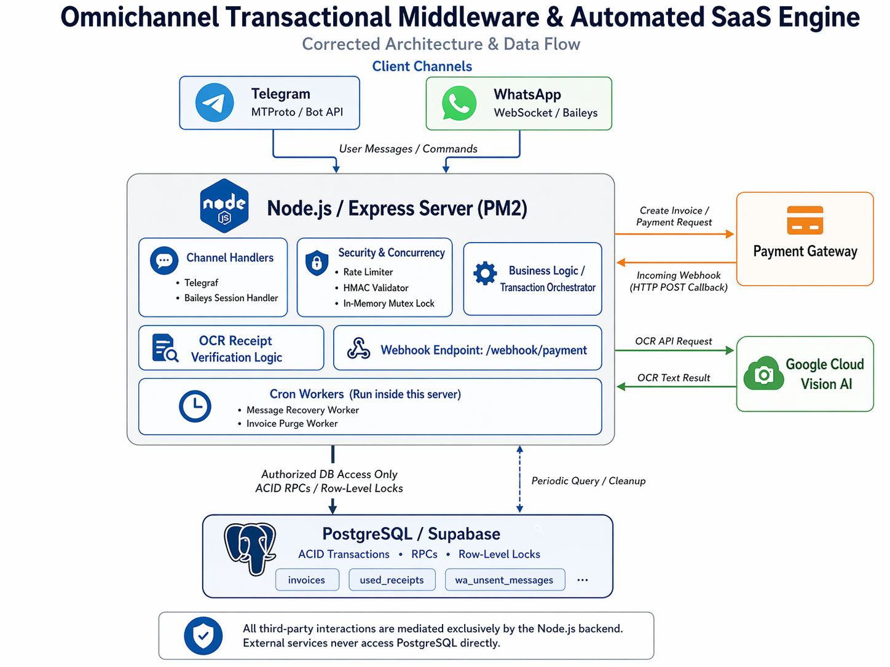
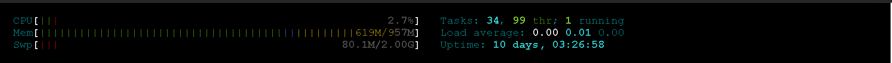

# saas-infrastructure-core
High-availability omnichannel middleware orchestrating ACID-compliant database locks, zero-trust webhooks, and AI-verified financial transactions
# Omnichannel Transactional Middleware & Automated SaaS Engine


> **Notice:** The source code for this repository is currently **Closed-Source / Proprietary**. It actively orchestrates live financial transactions, multi-tenant SaaS billing, and dynamic payment gateways. This document outlines the system architecture, concurrency models, and network security protocols implemented.

## 📌 System Overview

This system serves as a high-availability middleware that bridges localized messaging clients (Telegram MTProto & WhatsApp WebSockets) with external Payment Gateways. It is designed to handle asynchronous state changes, mitigate Layer 7 network anomalies, and enforce strict ACID-compliant database operations for multi-tenant environments.

## 🏗 Core Architecture & Tech Stack

* **Application Layer:** Node.js, Express.js
* **Protocol Interfaces:**
  * `Telegraf` (Telegram Bot API)
  * `@whiskeysockets/baileys` (Reverse-engineered WhatsApp Web Socket)
* **Database Engine:** PostgreSQL (via Supabase) with customized Remote Procedure Calls (RPC)
* **Machine Learning:** `@google-cloud/vision` (Optical Character Recognition for Receipt Verification)
* **Infrastructure:** Linux VPS, PM2 Process Manager, Nginx Reverse Proxy

---

## 🔒 Security & Concurrency Engineering

Processing financial transactions over volatile messaging protocols requires extreme fault tolerance and anti-fraud mechanisms.

### 1. In-Memory Mutex Locks & Rate Limiting

To prevent "Double-Spending" from rapid client interactions, a memory-based Mutex Lock intercepts concurrent requests. Webhook endpoints are heavily fortified using custom IP trackers and `express-rate-limit` to mitigate Layer 7 DDoS attacks.

```javascript
// In-Memory Mutex Implementation (Anti-Double Click/Race Condition)
const lockedUsers = new Map();

const lockUser = (userId) => {
    if (lockedUsers.has(userId)) return false; // Reject concurrent execution
    // Fail-safe: Auto-unlock after 15 seconds to prevent permanent deadlocks
    const timeout = setTimeout(() => unlockUser(userId), 15000);
    lockedUsers.set(userId, timeout);
    return true; 
};
```

### 2. Zero-Trust Webhook & Cryptographic Handshakes

The system assumes all incoming HTTP requests to `/webhook/payment` are hostile. Payloads are subjected to strict cryptographic validation (HMAC SHA-256, MD5) using raw buffer extraction.

```javascript
// Validating incoming Gateway callbacks
const providedSig = req.headers['x-callback-signature']; 
const rawPayload = JSON.stringify(payload);
const expectedSig = crypto.createHmac('sha256', apiKey).update(rawPayload).digest('hex');

if (providedSig !== expectedSig) {
    console.error(`[🚨 FRAUD] Invalid HMAC signature detected on invoice ${orderId}`);
    return res.status(403).json({ error: 'Spoofing detected' });
}
```

### 3. Atomic Database Locks (ACID Compliance)

The Node.js runtime does not compute critical balances. Mathematical operations and inventory locks are offloaded entirely to the PostgreSQL kernel using RPCs, ensuring transactional integrity even during multi-tenant traffic spikes.

```sql
-- Conceptual representation of the RPC executed by the Node.js backend
-- Performs row-level locking to prevent race-conditions on stock claims
SELECT * FROM claim_stock(p_code, p_ref_id, p_role);
```

---

## 🤖 AI-Assisted Manual Verification (Fallback Protocol)

In scenarios where payment gateway APIs suffer downtime, the system fails over to a manual verification flow utilizing **Google Cloud Vision AI**.

* Users upload payment receipts.
* The OCR engine extracts text and sanitizes the payload.
* The system utilizes Regex to isolate exact transfer amounts and unique Bank Reference IDs, cross-referencing them against the database to prevent receipt reuse.

```javascript
// Intercepting and Verifying Payment Receipts via AI
const [result] = await visionClient.documentTextDetection(requestObject);
const fullText = result.fullTextAnnotation?.text || '';

// Exact Amount Verification
const expectedAmount = parseInt(pendingTrx.amount);
const moneyRegex = /(?:rp\s*|idr\s*)?\b(\d{1,3}(?:[.,]\d{3})+(?:[.,]\d{2})?|\d{4,})\b/gi;
// ... [Regex Extraction Logic Omitted for Brevity] ...

// Anti-Fraud: Receipt Reuse Prevention
const { data: existingReceipt } = await supabase
    .from('used_receipts').select('bank_ref_id').eq('bank_ref_id', bankRefId).single();

if (existingReceipt) throw new Error("⛔ SCAM ALERT: Receipt already utilized!");
```

---

## 🏥 Disaster Recovery & Fault Tolerance

* **Orphaned Message Recovery:** Network partitions can cause sockets to drop exactly when a transaction succeeds. An automated Cron worker sweeps a `wa_unsent_messages` buffer table every 2 minutes, forcing a cryptographic handshake before re-attempting delivery.
* **Zombie Transaction Purge:** A background garbage collector aggressively sweeps and terminates unpaid invoices older than 15 minutes, automatically releasing locked database constraints.
* **Graceful Shutdown Interceptors:**
```javascript
  const gracefulShutdown = async (signal) => {
      console.log(`\n[SYSTEM] Received ${signal}. Securing database locks...`);
      server.close(() => process.exit(0));
  };
  process.on('SIGINT', () => gracefulShutdown('SIGINT'));
  process.on('SIGTERM', () => gracefulShutdown('SIGTERM'));
```

---

## 📈 System Observability

*(These are visual proofs of the live production environment)*

### 1. High-Level Architecture Flow

*Diagram representing the routing of webhooks, AI processing, and database locking mechanisms.*

### 2. Live Server Telemetry

*PM2 and htop metrics demonstrating stable heap memory allocation and CPU usage under load.*

### 3. Automated Error Mitigation

*Terminal output showcasing the AI successfully intercepting a duplicated receipt attempt and the Cron worker recovering an unsent payload.*
